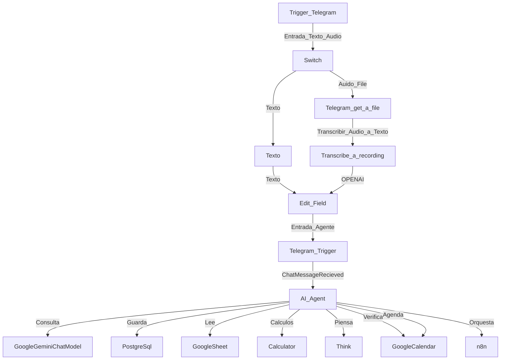

# ia-agent-n8n-telegram
Este flujo de trabajo en n8n implementa un agente conversacional inteligente que interactúa con usuarios a través de Telegram, ofreciendo información sobre los servicios de la empresa y gestionando reuniones de consultoría de forma automatizada.

##  Características principales

-  **Automatización con n8n**: Flujos diseñados para orquestar eventos, validar disponibilidad y ejecutar acciones.
-  **Agente de IA**: Interacción conversacional con lógica contextual y persistencia de memoria.
-  **Integración con Google Calendar**: Consulta de disponibilidad y creación de eventos.
-  **Base de conocimiento**: Acceso a información estructurada para respuestas más precisas.
-  **Persistencia de chat**: Almacenamiento de conversaciones para continuidad y análisis.

##  Tecnologías utilizadas

| Componente        | Tecnología / Servicio         |
|-------------------|-------------------------------|
| Backend Agent     | Google Gemini Chat Model      |
| Backend Agent     | OPENAI Transcribe a Recording |
| Trigger Telegram  | Terlegram App                 |
| Automatización    | n8n                           |
| Calendario        | Google Calendar API           |
| Hoja de Cálculo   | Google Sheet API              |
| Persistencia      | SimpleMemory                  |
| Infraestructura   | Docker / WSL / Linux          |

##  Arquitectura

  Cómo desplegar
1. Clona el repositorio:
   git clone https://github.com/liusvani/calendar-email-ai-agent.git
   cd calendar-email-ai-agent
2. Configura las variables de entorno:
  - GOOGLE_API_KEY
  - N8N_WEBHOOK_URL
  - MEMORY_DB_URL
3. Levanta los servicios con Docker:
  1. Accede a n8n y configura los flujos:
  2. Importa el archivo flows/calendar-booking.json
  3. Ajusta los nodos según tus credenciales

Licencia
Este proyecto está bajo la licencia MIT. Consulta el archivo LICENSE para más detalles.
